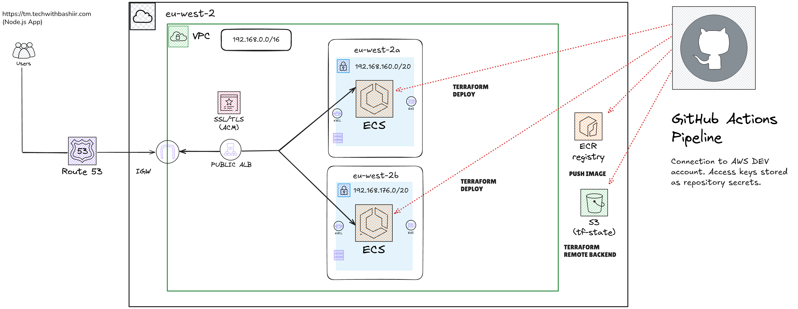

# ECS-Threat-Modelling-Tool

This project deploys a containerized Node.js web application on AWS using Elastic Container Service (ECS). The infrastructure is fully managed through Terraform modules, and deployments are automated via a GitHub Actions CI/CD pipeline. 

The entire architecture is designed for scalability, repeatability, and simplicity — ideal for modern cloud-native application delivery.

## Key components include:
	- ECS (Fargate) – for running containers without managing servers
	- ECR – to store Docker container images
	- Application Load Balancer (ALB) – for distributing traffic across ECS tasks
	- Route 53 + ACM – to route traffic and enable HTTPS with custom domain
	- Terraform – for IaC (Infrastructure as Code) using modular design
	- GitHub Actions – for automated provisioning and deployments
	- S3 + DynamoDB – as Terraform remote backend and state lock management

